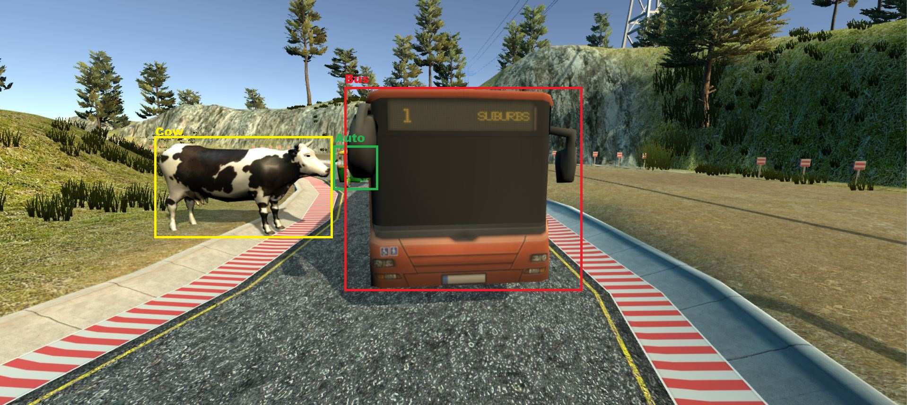
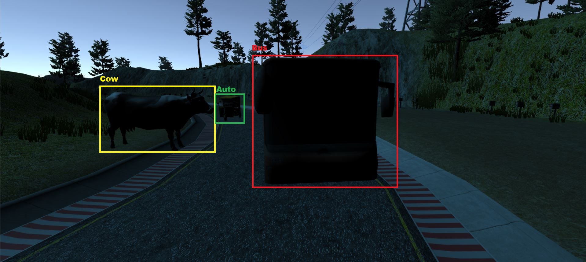
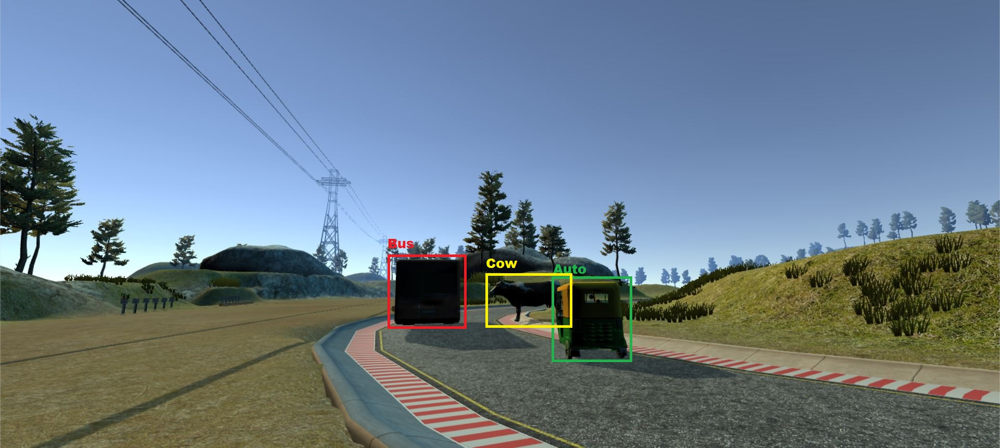
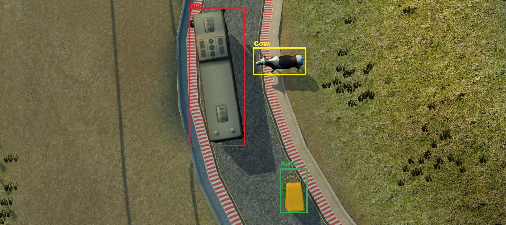

## Indian Street Simulator

This simulator was built using Unity 3D Game Engine on top of [Udacity's Self-Driving Car Nanodegree](https://udacity.com/drive). It helps generating bounding box annotations from hyper realistic rendering of a virtual city/village and simulate cameras which collect data right from the street. These annoations can then be fed innto models like RCNN, YOLOv3 or SSD for object detection.

### Why we need such a simulator?
1. Presently most of the State-of-the art algorithms in image classification, detection and segmentation rely on manually annotated images.

2. While this isn’t such a big problem in general but for Indian context there is a scarcity for such data.

3. Another problem is that, there is a huge variety of situations that can be encountered on Indian street which would demand a diverse dataset.

### Features
1. Detect position on screen of specified objects by taking projection on camera plane.
1. Create annotations in VOC format or COCO format by writing in log files at fixed frame rate.
2. Change lighting condition, weather conditions and perspective.

### Unity Simulator User Instructions

1. Clone the repository to your local directory, please make sure to use [Git LFS](https://git-lfs.github.com) to properly pull over large texture and model assets. 

2. Install the free game making engine [Unity](https://unity3d.com), if you dont already have it. Unity is necessary to load all the assets.

3. Load Unity, Pick load exiting project and choice the `self-driving-car-sim` folder.

4. Load up scenes by going to Project tab in the bottom left, and navigating to the folder Assets/1_SelfDrivingCar/Scenes. The project has some sample India specific vehicles like CNG Autorikshaw and Low floor bus. It also has elements like cow on street.

5. Play a scene. Jump into game mode anytime by simply clicking the top play button arrow right above the viewing window.

6. View Scripts. Scripts are what make all the different mechanics of the simulator work and they are located in two different directories, the first is Assets/1_SelfDrivingCar/Scripts which mostly relate to the UI and socket connections. The second directory for scripts is Assets/Standard Assets/Vehicle/Car/Scripts and they control all the different interactions with the car.

### Example bounding box generations
Normal View

Low light condition

Back Perspective

Top Perspective

